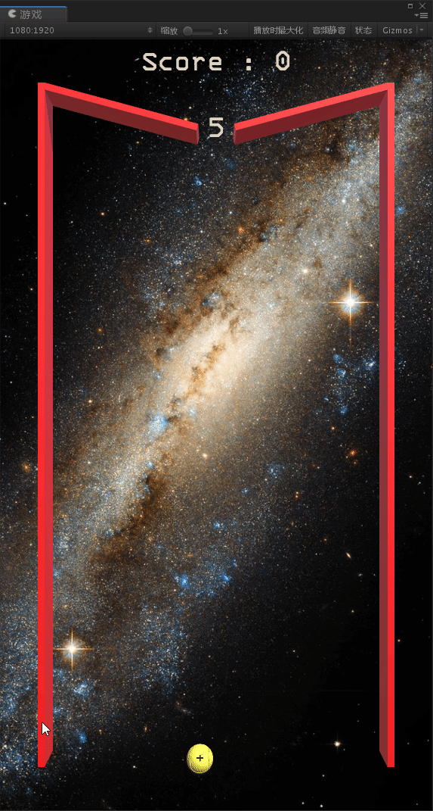

# Block-Ball（打砖球）by Unity 3D

技术点：

1. 设置背景（Android/iOS/Windows/Mac）
2. 射线检测，层遮罩
3. 碰撞检测，反弹
4. 鼠标点击事件/移动端触屏事件
4. 加载/销毁预制体
5. 使用3DText显示数字
6. GUIStyle/TextMesh控制文字
6. 游戏逻辑：增加“+”道具，打掉可以增加弹容量

To-Do：

1. 装填Bullet Ball时从两边回到顶部
2. Block消失Shader

